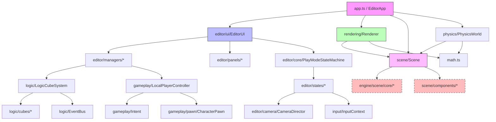

# Obecna Struktura Projektu

## Przegląd

Projekt znajduje się w stanie hybrydowym - częściowo zmodularyzowanej architektury z duplikacjami kodu. Główny kod znajduje się w `src/`, z częściową migracją do `src/engine/`.

## Status: Hybryda z Duplikacjami

### ⚠️ Problemy Obecnej Struktury

1. **Duplikacje kodu**:
   - `src/scene/` vs `src/engine/scene/`
   - `src/physics/` vs `src/engine/physics/`
   - Import chaos: `src/scene/index.ts` importuje z `./engine/scene`

2. **Niespójna organizacja**:
   - Część modułów w root `src/`
   - Część modułów w `src/engine/`
   - Brak jasnych granic odpowiedzialności

3. **Brak separacji**:
   - Edytor i runtime zmieszane
   - Rendering zna o EditorUI
   - Brak czystych API boundaries

## Struktura Katalogów

```
src/
├── __tests__/                      # Testy jednostkowe (358 testów)
│   ├── AnimationStateMachine.test.ts
│   ├── PhysicsSystem.test.ts
│   ├── editor-*.test.ts
│   └── helpers/
│
├── animation/                      # ❌ Powinno być w engine lub stdlib
│   ├── AnimationClip.ts
│   ├── AnimationController.ts
│   ├── AnimationStateMachine.ts
│   ├── AnimationSystem.ts
│   ├── interpolation.ts
│   ├── SkeletalAnimation.ts
│   └── types.ts
│
├── app/                            # ⚠️ Częściowo zorganizowany edytor
│   ├── editor/
│   ├── managers/
│   ├── panels/
│   └── utils/
│
├── audio/                          # ❌ Powinno być w engine lub stdlib
│   ├── AudioManager.ts
│   └── AudioSystem.ts
│
├── editor/                         # ✅ Dobrze zorganizowany edytor
│   ├── assets/
│   │   ├── AssetRegistry.ts       # Asset management
│   │   ├── AssetLibrary.ts
│   │   ├── AssetImporter.ts
│   │   └── ...
│   ├── camera/
│   │   ├── CameraDirector.ts      # Unified camera system
│   │   └── CameraState.ts
│   ├── controllers/
│   │   ├── BlockDragController.ts
│   │   ├── EditorPlacementController.ts
│   │   ├── RotationController.ts
│   │   └── ...
│   ├── core/
│   │   ├── PlayModeStateMachine.ts # ✅ Dobry design
│   │   ├── PlayManifest.ts
│   │   ├── WorldManager.ts
│   │   └── ...
│   ├── grid/
│   ├── history/                    # Undo/Redo system
│   ├── managers/
│   │   ├── EditorModeManager.ts   # Edit/Play mode
│   │   ├── LogicCubeLibrary.ts
│   │   └── ...
│   ├── panels/
│   │   ├── AssetBrowser.ts
│   │   ├── OutlinerPanel.ts
│   │   ├── PropertiesPanel.ts
│   │   └── ...
│   ├── placement/
│   ├── snap/
│   ├── states/                     # Play mode states
│   │   ├── EditState.ts
│   │   ├── PlayingState.ts
│   │   ├── PreflightState.ts
│   │   └── ...
│   ├── ui/
│   │   ├── EditorUI.ts             # Main editor entry
│   │   └── ...
│   ├── utils/
│   ├── visuals/
│   └── workflows/
│
├── engine/                         # ⚠️ Próba modularyzacji (niekompletna)
│   ├── animation/                  # ❌ DUPLIKAT src/animation/
│   ├── audio/                      # ❌ DUPLIKAT src/audio/
│   ├── config/
│   ├── logic/                      # ❌ DUPLIKAT src/logic/
│   ├── math/
│   ├── physics/
│   │   └── systems/
│   │       └── CharacterControllerSystem.ts
│   ├── rendering/
│   ├── resources/
│   └── scene/                      # ⚠️ GŁÓWNE ECS, ale duplikowane w src/scene/
│       ├── components/
│       │   ├── Component.ts        # Base Component class
│       │   ├── AnimationComponent.ts
│       │   ├── CameraComponent.ts
│       │   ├── CharacterController.ts
│       │   ├── EnvironmentComponent.ts
│       │   ├── JointComponent.ts
│       │   ├── LightComponent.ts
│       │   ├── LogicCubeComponent.ts
│       │   ├── MaterialComponent.ts
│       │   ├── MeshComponent.ts
│       │   ├── PhysicsComponent.ts
│       │   ├── RuntimePlayerTag.ts
│       │   ├── ScriptComponent.ts
│       │   └── registry.ts
│       ├── core/
│       │   ├── Entity.ts           # ✅ Core ECS Entity
│       │   ├── Scene.ts            # ✅ Core ECS Scene
│       │   └── Transform.ts
│       └── systems/
│           ├── Raycaster.ts
│           └── Selection.ts
│
├── gameplay/                       # ✅ Gameplay logic
│   ├── controllers/
│   ├── pawn/
│   │   └── CharacterPawn.ts
│   ├── session/
│   ├── tags/
│   ├── Controller.ts
│   ├── Intent.ts
│   ├── LocalPlayerController.ts
│   ├── ManifestBindings.ts
│   ├── PlayerControllerFactory.ts
│   └── PlayerSession.ts
│
├── input/
│   ├── CharacterInput.ts
│   └── InputContext.ts             # ✅ Stack-based input contexts
│
├── logic/                          # ✅ LogicCubes system (UGC scripting)
│   ├── cubes/
│   │   ├── ActionCubes.ts
│   │   ├── ConditionCubes.ts
│   │   ├── DataCubes.ts
│   │   ├── LogicCube.ts
│   │   ├── LogicGateCubes.ts
│   │   ├── PlayerDetection.ts
│   │   ├── TriggerCubes.ts
│   │   └── types.ts
│   ├── services/
│   │   └── SceneScriptContextBuilder.ts
│   ├── Behavior.ts
│   ├── BehaviorRegistry.ts
│   ├── CoroutineScheduler.ts
│   ├── EventBus.ts                 # ✅ Event system
│   ├── LogicConnectionManager.ts
│   ├── LogicConnectionRegistry.ts
│   ├── LogicCubeSystem.ts
│   ├── ScriptSystem.ts
│   ├── types.ts
│   └── VariableStorage.ts
│
├── physics/                        # ⚠️ DUPLIKAT src/engine/physics/
│   ├── BoundingVolume.ts
│   ├── CollisionDetection.ts
│   ├── index.ts
│   ├── inertia.ts
│   ├── Joint.ts
│   ├── Octree.ts
│   ├── PhysicsRaycast.ts
│   ├── PhysicsSystem.ts            # ✅ Main physics system
│   └── PhysicsWorld.ts
│
├── rendering/                      # ✅ WebGPU Renderer
│   ├── blocks/
│   │   └── BlockLibrary.ts
│   ├── config.ts
│   ├── core/
│   │   ├── bufferPool.ts
│   │   ├── CameraSystem.ts
│   │   ├── ComputePrepass.ts
│   │   ├── FrameRenderer.ts
│   │   ├── FrustumCuller.ts
│   │   ├── helpers.ts
│   │   ├── InstanceManager.ts
│   │   ├── LightingUniforms.ts
│   │   ├── Renderer.ts             # ✅ Main renderer
│   │   └── UniformManager.ts
│   ├── index.ts
│   ├── lighting/
│   │   └── LightManager.ts
│   ├── LogicConnectionRenderer.ts
│   ├── materials/
│   │   ├── Material.ts
│   │   ├── MaterialManager.ts
│   │   ├── MaterialPresets.ts
│   │   └── TextureBindingManager.ts
│   ├── postprocess/
│   │   ├── Bloom.ts
│   │   ├── BrdfLut.ts
│   │   └── TonemapLut.ts
│   ├── renderers/
│   │   ├── EnvironmentRenderer.ts
│   │   └── ThumbnailRenderer.ts
│   ├── resources/
│   │   └── resources.ts
│   ├── shaders/
│   │   ├── chunks.ts
│   │   ├── lighting.ts
│   │   ├── lineShader.ts
│   │   ├── main.ts
│   │   ├── pbr.ts
│   │   ├── postprocess/
│   │   │   └── tonemap_lut.wgsl
│   │   └── types.ts
│   ├── shadows/
│   │   ├── ShadowCascades.ts
│   │   └── ShadowPass.ts
│   └── textures/
│       ├── ConnectedTextures.ts
│       ├── NoiseGenerator.ts
│       ├── ProceduralTextureGenerator.ts
│       ├── TextureAtlas.ts
│       ├── TextureCache.ts
│       ├── TextureLoader.ts
│       ├── TextureManager.ts
│       └── TextureRegistry.ts
│
├── scene/                          # ⚠️ DUPLIKAT src/engine/scene/
│   ├── components/
│   │   ├── AnimationComponent.ts   # ❌ Duplikat
│   │   ├── CameraComponent.ts      # ❌ Duplikat
│   │   ├── Component.ts            # ❌ Duplikat
│   │   └── ...
│   ├── CharacterControllerSystem.ts
│   ├── Entity.ts                   # ❌ Duplikat
│   ├── index.ts                    # ⚠️ Importuje z ./engine/scene!
│   ├── Raycaster.ts
│   ├── Scene.ts                    # ❌ Duplikat
│   ├── Selection.ts
│   └── Transform.ts
│
├── styles/                         # ✅ CSS dla editora
│   └── [54 pliki .css]
│
├── test/
│   └── setup.ts                    # ✅ Test configuration
│
├── types/
│   └── draco3dgltf.d.ts
│
├── utils/
│   └── [4 pliki]
│
├── app.ts                          # ✅ Main EditorApp class
├── bootstrap.ts                    # ✅ Entry point
├── input.ts                        # Orbit controls
├── logger.ts                       # ⚠️ Powinno być w app/utils/
├── main.ts                         # ✅ Vite entry
└── math.ts                         # ⚠️ Powinno być w engine/math/
```

## Kluczowe Moduły i Ich Lokalizacje

### 1. ECS Core (Entity-Component-System)

**Główna implementacja**: `src/engine/scene/`

| Plik | Opis | Status |
|------|------|--------|
| `engine/scene/core/Entity.ts` | Entity base class, ID management | ✅ Główny |
| `engine/scene/core/Scene.ts` | Scene manager, entity hierarchy | ✅ Główny |
| `engine/scene/core/Transform.ts` | Transform component (position, rotation, scale) | ✅ Główny |
| `engine/scene/components/Component.ts` | Base Component class | ✅ Główny |

**Duplikaty**: `src/scene/` - należy usunąć

### 2. Rendering (WebGPU)

**Lokalizacja**: `src/rendering/`

| Moduł | Opis |
|-------|------|
| `rendering/core/Renderer.ts` | Main renderer initialization (`initRenderer`) |
| `rendering/core/FrameRenderer.ts` | Frame-by-frame rendering |
| `rendering/materials/` | PBR material system |
| `rendering/shadows/` | Shadow mapping (cascaded) |
| `rendering/postprocess/` | Bloom, tonemap, LUT |
| `rendering/textures/` | Texture atlas, cache, loading |

**Zależności**:
- ✅ `src/engine/scene/` (ECS components)
- ✅ `src/math.ts` (matematyka)
- ⚠️ Wie o edytorze (do zmiany)

### 3. Physics

**Lokalizacja**: `src/physics/`

| Plik | Opis |
|------|------|
| `PhysicsWorld.ts` | Main physics world |
| `PhysicsSystem.ts` | Physics tick system |
| `CollisionDetection.ts` | AABB, OBB, sphere collision |
| `BoundingVolume.ts` | Bounding volumes |
| `Joint.ts` | Physics constraints |
| `Octree.ts` | Spatial partitioning |

**Duplikat**: `src/engine/physics/systems/CharacterControllerSystem.ts`

### 4. Animation

**Lokalizacja**: `src/animation/`

| Plik | Opis |
|------|------|
| `AnimationSystem.ts` | Main animation system |
| `AnimationStateMachine.ts` | State machine for animations |
| `AnimationClip.ts` | Animation clips |
| `SkeletalAnimation.ts` | Skeletal animation |
| `Skeleton.ts` | Bone hierarchy |

**Duplikat**: `src/engine/animation/`

### 5. Audio

**Lokalizacja**: `src/audio/`

| Plik | Opis |
|------|------|
| `AudioSystem.ts` | Main audio system |
| `AudioManager.ts` | Audio resource management |

**Duplikat**: `src/engine/audio/`

### 6. Logic System (UGC Scripting)

**Lokalizacja**: `src/logic/`

| Moduł | Opis |
|-------|------|
| `LogicCubeSystem.ts` | Main logic cube execution system |
| `ScriptSystem.ts` | Script execution runtime |
| `cubes/` | Built-in LogicCubes (Actions, Conditions, Data, etc.) |
| `EventBus.ts` | Event system dla scriptów |
| `BehaviorRegistry.ts` | Behavior registration |

**Status**: ✅ Dobry design UGC scripting system

**Duplikat**: `src/engine/logic/`

### 7. Gameplay

**Lokalizacja**: `src/gameplay/`

| Plik | Opis |
|------|------|
| `Controller.ts` | Base controller |
| `LocalPlayerController.ts` | Player controller |
| `pawn/CharacterPawn.ts` | Character pawn |
| `Intent.ts` | Player intent system |
| `ManifestBindings.ts` | Play manifest bindings |

**Status**: ✅ Dobry design

### 8. Editor

**Lokalizacja**: `src/editor/`

| Moduł | Opis | Status |
|-------|------|--------|
| `ui/EditorUI.ts` | Main editor entry point | ✅ |
| `core/PlayModeStateMachine.ts` | Play/Edit mode state machine | ✅ Excellent |
| `core/WorldManager.ts` | Authoring vs Runtime world separation | ✅ |
| `camera/CameraDirector.ts` | Unified camera system | ✅ |
| `managers/EditorModeManager.ts` | Mode management | ✅ |
| `panels/` | UI panels (Outliner, Properties, Assets) | ✅ |
| `history/` | Undo/Redo system | ✅ |
| `assets/` | Asset management | ✅ |

**Status**: ✅ Bardzo dobrze zorganizowany

### 9. Input

**Lokalizacja**: `src/input/`

| Plik | Opis |
|------|------|
| `input.ts` | Orbit controls (root) |
| `input/InputContext.ts` | Stack-based input contexts |
| `input/CharacterInput.ts` | Character input handling |

**Status**: ⚠️ Rozproszony (root vs input/)

### 10. Math

**Lokalizacja**: `src/math.ts` (single file)

**Zawartość**:
- Vec3, Mat4, Quat operations
- Matrix helpers (lookAt, perspective, multiply, etc.)
- Używane wszędzie w projekcie

**Status**: ⚠️ Powinno być w module

## Diagram Zależności



**Legenda**:
- 🟪 Różowy: Główna aplikacja
- 🟦 Niebieski: Edytor
- 🟩 Zielony: Rendering
- 🟪 Jasnoróżowy: Scene
- 🟥 Czerwony przerywany: Duplikaty

## Import Chaos - Przykłady

### src/scene/index.ts
```typescript
export { Scene, type SceneData } from './engine/scene';
//                                     ^^^^^^^^^^^^^^
//                                     Importuje z engine!
```

### src/app.ts
```typescript
import { Scene } from './scene';              // Który Scene? src/scene czy engine/scene?
import { mat4LookAt } from './math';          // Root math.ts
import { CameraComponent } from './scene/components/CameraComponent';
```

### src/bootstrap.ts
```typescript
import { Logger } from './app/utils/logger';  // app/utils/
import { assetRegistry } from './editor/assets/AssetRegistry';
import { registerBuiltInLogicCubes } from './logic/cubes';
```

## Analiza Duplikacji

### Duplikaty Kodu

| Oryginalny Moduł | Duplikat | Akcja |
|------------------|----------|-------|
| `src/engine/scene/` | `src/scene/` | ❌ Usunąć `src/scene/`, używać tylko `engine/scene` |
| `src/engine/physics/` | `src/physics/` | ❌ Usunąć `engine/physics`, używać tylko `src/physics` |
| `src/animation/` | `src/engine/animation/` | ❌ Usunąć jeden, wybrać docelową lokalizację |
| `src/audio/` | `src/engine/audio/` | ❌ Usunąć jeden, wybrać docelową lokalizację |
| `src/logic/` | `src/engine/logic/` | ❌ Usunąć jeden, wybrać docelową lokalizację |

### Moduły do Reorganizacji

| Moduł | Obecna Lokalizacja | Problem |
|-------|-------------------|---------|
| `math.ts` | Root `src/` | Powinno być w module, nie single file |
| `logger.ts` | Root `src/` | Powinno być w `app/utils/` |
| `input.ts` | Root `src/` | Orbit controls - powinno być w `editor/camera/` |
| `app.ts` | Root `src/` | OK dla teraz, ale docelowo `apps/editor/` |
| `bootstrap.ts` | Root `src/` | OK dla teraz, ale docelowo `apps/editor/` |

## Statystyki

### Pliki i Katalogi

```
src/
├── 358 plików testowych (__tests__/)
├── ~300 plików źródłowych (.ts)
├── 54 pliki CSS (styles/)
├── 1 plik WGSL (shaders/)
```

### Testy

- **Suma testów**: 358 (100% passing)
- **Typy testów**:
  - Unit tests: ~320
  - Integration tests: ~38
- **Coverage**: Brak danych (do sprawdzenia)

### Linie Kodu (szacunkowo)

| Moduł | LOC |
|-------|-----|
| `rendering/` | ~8,000 |
| `editor/` | ~6,000 |
| `engine/scene/` | ~3,000 |
| `physics/` | ~2,500 |
| `logic/` | ~2,000 |
| `gameplay/` | ~1,500 |
| `animation/` | ~1,200 |
| Pozostałe | ~3,000 |
| **Suma** | **~27,000** |

## Wnioski

### ✅ Co Działa Dobrze

1. **Play Mode State Machine** (`editor/core/`) - Excellent design
2. **ECS w engine/scene/** - Solidny fundament
3. **Rendering pipeline** - Kompletny WebGPU renderer z PBR
4. **LogicCubes system** - Dobry fundament pod UGC scripting
5. **Editor organization** - Struktura paneli i managerów

### ❌ Główne Problemy

1. **Duplikacje** - `scene/`, `physics/`, `animation/`, `audio/`, `logic/`
2. **Import chaos** - Niejasne ścieżki importów
3. **Brak granic** - Renderer wie o edytorze
4. **Rozproszenie** - Math, logger, input w root
5. **Brak monorepo** - Wszystko w jednym `src/`

### 🎯 Następne Kroki

1. **Usunąć duplikaty** - Zdecydować które moduły pozostawić
2. **Zdefiniować moduły** - Stworzyć `packages/` i `apps/`
3. **Przeprowadzić migrację** - Krok po kroku (8 faz)
4. **Testy** - Upewnić się, że testy nadal przechodzą
5. **Dokumentacja** - Opisać nową architekturę

## Referencje

- [PLAY_MODE_STATE_MACHINE.md](./PLAY_MODE_STATE_MACHINE.md) - Dokumentacja play mode
- [TESTING.md](./TESTING.md) - Dokumentacja testów
- `package.json` - 358 testów, vitest, vite, TypeScript

