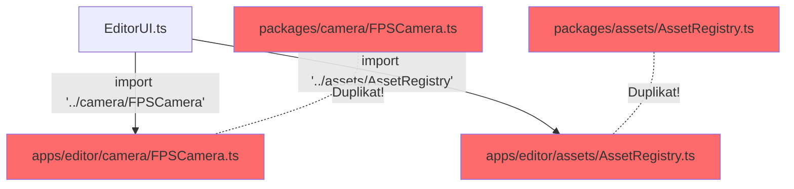
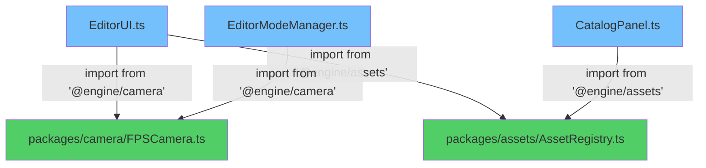

# Diagram: apps/editor ↔ packages

## Stan obecny (❌ Problematyczny)

```
┌─────────────────────────────────────────────────────────────┐
│                     apps/editor/src/                         │
├─────────────────────────────────────────────────────────────┤
│                                                               │
│  ┌───────────────────────────────────────────┐               │
│  │  editor/camera/                           │               │
│  │  ├── CameraDirector.ts  (364 linii) ❌   │               │
│  │  └── FPSCamera.ts       (184 linie) ❌   │               │
│  └───────────────────────────────────────────┘               │
│         │                                                     │
│         │ import '../camera/CameraDirector'  (BAD)           │
│         ↓                                                     │
│  ┌───────────────────────────────────────────┐               │
│  │  editor/managers/EditorModeManager.ts     │               │
│  │  editor/ui/EditorUI.ts                    │               │
│  │  editor/states/*.ts                       │               │
│  └───────────────────────────────────────────┘               │
│                                                               │
│  ┌───────────────────────────────────────────┐               │
│  │  editor/assets/                           │               │
│  │  ├── AssetRegistry.ts   (689 linii) ⚠️   │               │
│  │  ├── AssetImporter.ts   (51 linii)  ❌   │               │
│  │  └── GltfOptimizer.ts   (225 linii) ❌   │               │
│  └───────────────────────────────────────────┘               │
│         │                                                     │
│         │ import './AssetRegistry'  (BAD)                    │
│         ↓                                                     │
│  ┌───────────────────────────────────────────┐               │
│  │  editor/ui/CatalogPanel.ts                │               │
│  │  editor/assets/AssetBrowser.ts            │               │
│  └───────────────────────────────────────────┘               │
│                                                               │
└─────────────────────────────────────────────────────────────┘
                         │
                         │ Duplikacja! 🔴
                         ↓
┌─────────────────────────────────────────────────────────────┐
│                      packages/                               │
├─────────────────────────────────────────────────────────────┤
│                                                               │
│  ┌───────────────────────────────────────────┐               │
│  │  camera/src/                              │               │
│  │  ├── CameraDirector.ts  (367 linii) ❌   │               │
│  │  └── FPSCamera.ts       (185 linii) ❌   │               │
│  └───────────────────────────────────────────┘               │
│                                                               │
│  ┌───────────────────────────────────────────┐               │
│  │  assets/src/                              │               │
│  │  ├── core/                                │               │
│  │  │   ├── AssetRegistry.ts (688 linii) ⚠️ │               │
│  │  │   └── AssetTypes.ts                   │               │
│  │  └── loaders/                             │               │
│  │      ├── AssetImporter.ts  (52 linie) ❌ │               │
│  │      └── GltfOptimizer.ts (216 linii) ❌ │               │
│  └───────────────────────────────────────────┘               │
│                                                               │
│  PAKIETY ZADEKLAROWANE ALE NIEUŻYWANE! ⚠️                    │
│                                                               │
└─────────────────────────────────────────────────────────────┘

Problem: ~2000 linii zduplikowanego kodu!
```

---

## Stan docelowy (✅ Poprawny)

```
┌─────────────────────────────────────────────────────────────┐
│                     apps/editor/src/                         │
├─────────────────────────────────────────────────────────────┤
│                                                               │
│  ┌───────────────────────────────────────────┐               │
│  │  editor/camera/  [DELETED] ✅             │               │
│  └───────────────────────────────────────────┘               │
│                │                                              │
│                │ import { CameraDirector, FPSCamera }        │
│                │   from '@engine/camera'  (GOOD) ✅          │
│                ↓                                              │
│  ┌───────────────────────────────────────────┐               │
│  │  editor/managers/EditorModeManager.ts     │               │
│  │  editor/ui/EditorUI.ts                    │               │
│  │  editor/states/*.ts                       │               │
│  └───────────────────────────────────────────┘               │
│                                                               │
│  ┌───────────────────────────────────────────┐               │
│  │  editor/assets/                           │               │
│  │  └── AssetBrowser.ts  (UI only) ✅        │               │
│  └───────────────────────────────────────────┘               │
│                │                                              │
│                │ import { assetRegistry }                    │
│                │   from '@engine/assets'  (GOOD) ✅          │
│                ↓                                              │
│  ┌───────────────────────────────────────────┐               │
│  │  editor/ui/CatalogPanel.ts                │               │
│  │  editor/ui/AssetPalette.ts                │               │
│  └───────────────────────────────────────────┘               │
│                                                               │
│  TYLKO EDITOR-SPECIFIC CODE! ✅                              │
│  - UI Components                                             │
│  - Panels & Toolbars                                         │
│  - Editor State Management                                   │
│  - Workflows & UX                                            │
│                                                               │
└─────────────────────────────────────────────────────────────┘
                         │
                         │ Importy przez @engine/* ✅
                         ↓
┌─────────────────────────────────────────────────────────────┐
│                      packages/                               │
├─────────────────────────────────────────────────────────────┤
│                                                               │
│  ┌───────────────────────────────────────────┐               │
│  │  @engine/camera                           │               │
│  │  ├── CameraDirector.ts  ✅                │               │
│  │  ├── FPSCamera.ts       ✅                │               │
│  │  └── OrbitCamera.ts     ✅                │               │
│  └───────────────────────────────────────────┘               │
│                                                               │
│  ┌───────────────────────────────────────────┐               │
│  │  @engine/assets                           │               │
│  │  ├── core/                                │               │
│  │  │   ├── AssetRegistry.ts  ✅            │               │
│  │  │   ├── AssetTypes.ts     ✅            │               │
│  │  │   └── RecentAssetsTracker.ts ✅       │               │
│  │  └── loaders/                             │               │
│  │      ├── AssetImporter.ts   ✅            │               │
│  │      └── GltfOptimizer.ts   ✅            │               │
│  └───────────────────────────────────────────┘               │
│                                                               │
│  ┌───────────────────────────────────────────┐               │
│  │  @engine/editor-utils  [NOWY PAKIET] 🆕  │               │
│  │  ├── HistoryManager.ts  ✅                │               │
│  │  └── SnapSystem.ts      ✅                │               │
│  └───────────────────────────────────────────┘               │
│                                                               │
│  ┌───────────────────────────────────────────┐               │
│  │  @engine/core                             │               │
│  │  └── utils/                               │               │
│  │      └── DisposableGroup.ts  ✅           │               │
│  └───────────────────────────────────────────┘               │
│                                                               │
│  SINGLE SOURCE OF TRUTH! ✅                                  │
│  - Współdzielona logika biznesowa                           │
│  - Reużywalne systemy                                        │
│  - Core functionality                                        │
│  - Używane przez multiple apps                               │
│                                                               │
└─────────────────────────────────────────────────────────────┘

Rozwiązanie: Zero duplikatów, jasna separacja!
```

---

## Przepływ importów

### ❌ PRZED (Niepoprawny)



### ✅ PO (Poprawny)



---

## Zasady alokacji kodu

```
┌────────────────────────────────────────────────────────────────┐
│                     Decision Tree                              │
└────────────────────────────────────────────────────────────────┘

                    [Nowa funkcjonalność]
                            │
                            ↓
            ┌───────────────────────────────┐
            │ Czy jest reużywalna           │
            │ poza editorem?                │
            └───────────────────────────────┘
                    │               │
                  TAK              NIE
                    ↓               ↓
    ┌───────────────────────┐   ┌──────────────────────┐
    │ Czy jest związana     │   │ apps/editor/         │
    │ z DOM/UI?             │   │ ✅ Editor-specific   │
    └───────────────────────┘   └──────────────────────┘
            │           │
          TAK          NIE
            ↓           ↓
    ┌──────────────┐  ┌─────────────────────┐
    │ apps/editor/ │  │ packages/           │
    │ ✅ UI logic  │  │ ✅ Shared business  │
    └──────────────┘  │    logic / utils    │
                      └─────────────────────┘


┌────────────────────────────────────────────────────────────────┐
│                         Przykłady                              │
└────────────────────────────────────────────────────────────────┘

packages/ (@engine/*)
├─ ✅ CameraDirector          - Logika kamer (reużywalna)
├─ ✅ FPSCamera               - Kontrola FPS (reużywalna)
├─ ✅ AssetRegistry           - Zarządzanie assetami (reużywalne)
├─ ✅ AssetImporter           - Ładowanie GLTF (reużywalne)
├─ ✅ HistoryManager          - Undo/redo (reużywalne)
├─ ✅ SnapSystem              - Snapping logic (reużywalne)
└─ ✅ DisposableGroup         - Utility pattern (reużywalny)

apps/editor/
├─ ✅ EditorUI               - Editor DOM interface
├─ ✅ CatalogPanel           - Panel UI
├─ ✅ EditorToolbar          - Toolbar UI
├─ ✅ EditorModeManager      - Editor state machine
├─ ✅ KeyboardHandler        - Editor shortcuts
├─ ✅ ProjectManager         - Editor persistence
├─ ✅ AssetBrowser           - Asset browser UI (używa AssetRegistry)
└─ ✅ EditorPersistence      - Editor-specific persistence
```

---

## Migration Checklist

### Faza 1: Quick Wins ⚡

```
☐ 1. Backup current state
      git checkout -b refactor/remove-duplicates
      
☐ 2. Usuń duplikaty camera
      rm apps/editor/src/editor/camera/CameraDirector.ts
      rm apps/editor/src/editor/camera/FPSCamera.ts
      
☐ 3. Zaktualizuj importy camera (12 plików)
      apps/editor/src/app.ts
      apps/editor/src/editor/managers/EditorModeManager.ts
      apps/editor/src/editor/ui/EditorUI.ts
      apps/editor/src/editor/states/ReturnState.ts
      apps/editor/src/editor/states/PlayingState.ts
      apps/editor/src/editor/states/PlayIntroState.ts
      + 6 więcej...
      
☐ 4. Usuń duplikaty assets
      rm apps/editor/src/editor/assets/AssetImporter.ts
      rm apps/editor/src/editor/assets/GltfOptimizer.ts
      
☐ 5. Zaktualizuj importy assets (8 plików)
      apps/editor/src/editor/assets/AssetBrowser.ts
      + 7 więcej...
      
☐ 6. Run tests
      pnpm test
      
☐ 7. Fix Logger issues (jeśli są)
      - Może być konieczne dodanie Logger config do pakietów
      
☐ 8. Commit
      git commit -m "refactor: remove camera and asset duplicates"
```

### Faza 2: AssetRegistry ⚙️

```
☐ 1. Dodaj logger config do packages/assets/src/core/AssetRegistry.ts
☐ 2. Zunifikuj AssetTypes między wersjami
☐ 3. Usuń apps/editor/src/editor/assets/AssetRegistry.ts
☐ 4. Zaktualizuj wszystkie importy assetRegistry
☐ 5. Testy integracyjne
☐ 6. Commit changes
```

### Faza 3: Utilities 🔧

```
☐ 1. Stwórz @engine/editor-utils package
☐ 2. Przenieś HistoryManager
☐ 3. Przenieś SnapSystem  
☐ 4. Przenieś DisposableGroup do @engine/core
☐ 5. Oceń GridRenderer placement
☐ 6. Zaktualizuj wszystkie importy
☐ 7. Tests
☐ 8. Commit
```

### Faza 4: Dokumentacja 📝

```
☐ 1. Napisz PACKAGE_GUIDELINES.md
☐ 2. Zaktualizuj ARCHITECTURE.md
☐ 3. Code review checklist
☐ 4. Team knowledge sharing
```

---

## Metryki

```
PRZED refactoringiem:
━━━━━━━━━━━━━━━━━━━━━━━━━━━━━━━━━━━━━━━━━━━━━━━
Duplikaty:              8 głównych plików
Linie duplikacji:       ~2000
Import inconsistencies: ~20 plików
Pakiety niewykorzystane: 2 (@engine/camera, @engine/assets)
Spójność architektury:  🔴 Niska


PO refactoringu:
━━━━━━━━━━━━━━━━━━━━━━━━━━━━━━━━━━━━━━━━━━━━━━━
Duplikaty:              0 ✅
Linie duplikacji:       0 ✅
Import consistency:     100% przez @engine/* ✅
Pakiety wykorzystane:   100% ✅
Spójność architektury:  🟢 Wysoka ✅
```

---

## Timeline

```
Week 1:
┌────┬────┬────┬────┬────┐
│Mon │Tue │Wed │Thu │Fri │
├────┼────┼────┼────┼────┤
│ Faza 1      │ Faza 2    │
│ Quick wins  │ AssetReg  │
└─────────────┴───────────┘

Week 2:
┌────┬────┬────┬────┬────┐
│Mon │Tue │Wed │Thu │Fri │
├────┼────┼────┼────┼────┤
│ Faza 2      │ Faza 3    │
│ (cont.)     │ Utils     │
└─────────────┴───────────┘

Week 3:
┌────┬────┬────┬────┬────┐
│Mon │Tue │Wed │Thu │Fri │
├────┼────┼────┼────┼────┤
│ Faza 3      │ Faza 4    │
│ (cont.)     │ Docs      │
└─────────────┴───────────┘

Total: ~11 dni roboczych
```

---

📄 **Pełna analiza:** [`EDITOR_PACKAGES_ANALYSIS.md`](./EDITOR_PACKAGES_ANALYSIS.md)  
📋 **Podsumowanie:** [`EDITOR_ANALYSIS_SUMMARY.md`](./EDITOR_ANALYSIS_SUMMARY.md)

